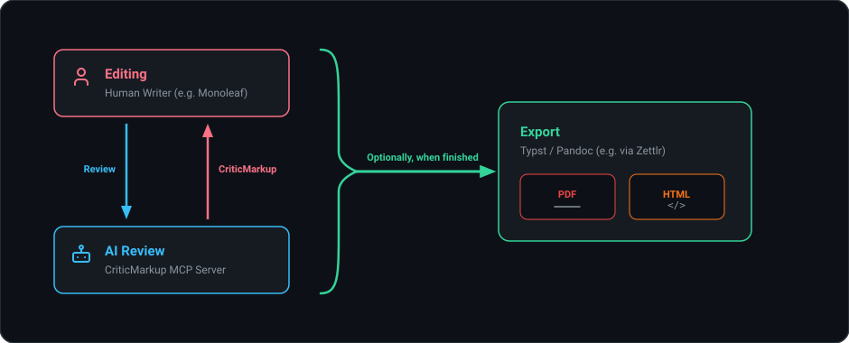

# mcp-criticmarkup

> Token-efficient, non-destructive editorial review and asynchronous track-changes for Markdown via the Model Context Protocol (MCP).

## Why?

If your project depends on your own critical input to succeed, and you want to actively review LLM changes without copying and pasting chat messages, you need a structured way for the model to propose edits. 

`mcp-criticmarkup` provides a frictionless alternative to Git workflows when collaborating with LLMs on Markdown documents. Instead of full-file overwrites or raw git diffs, the LLM proposes revisions using native [CriticMarkup](https://criticmarkup.com/) and manages threaded discussions.

<p align="center">
  
</p>


### What it allows LLM agents to do:
1. **Propose precise edits (CriticMarkup):**
   - Replace a single excerpt or perform deletions (`request_changes`).
   - Batch multiple revisions in one call (`replace_multiple`).
   - Perform global terminology replacements with word-boundary safety (`replace_all`).
2. **Engage in threaded discussions:**
   - Add new comments anchored to specific phrases or proposed diffs (`write_comment`).
   - Reply to existing discussion threads by ID (`reply_to_comment`).
3. **Inspect documents efficiently:**
   - Read the document while stripping heavy comment payloads to save tokens (`get_md_contents`).

---

## What then?

Authors can open the modified `.md` file in editors with native CriticMarkup support, such as [Monoleaf](https://monoleaf.org/). **LLM's edits then render as interactive track-changes that you can accept or reject like in Word**. CriticMarkup extensions for VS Code, Positron, and Obsidian may work for this purpose, although they might not support the comment syntax. 

### Exporting & Typesetting
When editing is complete, the clean Markdown can be compiled into nicely formatted documents. The pipeline I use myself is:

$$\text{Markdown} \xrightarrow{\text{Pandoc}} \text{Typst} \xrightarrow{} \text{PDF}$$

*(Zettlr export profiles can automate this in a single click, with alternate profiles for LaTeX PDF or HTML).*

> **Note on friction:** Markdown is occasionally not expressive enough for complex page layouts, requiring embedded raw typesetting blocks. For example, a Typst page break embedded inside Markdown:
> ```{=typst}
> #pagebreak()
> ```

---

## Included Tools

### Ingestion Tool
* **`get_md_contents(filepath)`**  
  Reads the document. Simplifies bulky comment payloads by replacing them with an abbreviated, token-efficient thread summary (`[UID] Author: Message`). Inline anchors remain in place so the model knows where discussions are tethered.

### Editing Tools
* **`replace_multiple(filepath, edits)`**  
  The primary multi-section editing tool. Accepts an array of `{"search_string": "...", "replacement_string": "..."}` objects.  
  * Free from word-boundary restrictions: accepts multi-line prose, sentences, and punctuation.
  * Validates all targets upfront and applies edits in reverse document order (bottom-to-top) to prevent offset drift.
  * Automatically preserves and slides comment anchors to the perimeter of the edit.
* **`request_changes(filepath, search_string, replacement_string)`**  
  Single-edit convenience wrapper. Emits `{--old--}` when `replacement_string` is empty, and `{~~old~>new~~}` otherwise.
* **`replace_all(filepath, search_string, replacement_string)`**  
  Global terminology substitution. Applies strict word boundaries (`\b`) to alphanumeric targets to prevent substring accidents. Automatically skips code blocks, inline code, links, YAML frontmatter, and existing CriticMarkup.

### Commenting Tools
* **`write_comment(filepath, search_string, comment_text)`**  
  Wraps `search_string` with conflict-safe inline anchors (`<!--c:{id}s-->...<!--c:{id}e-->`) and appends a Monoleaf-compatible thread payload to the bottom of the file.
* **`reply_to_comment(filepath, thread_id, reply_text)`**  
  Appends an `AI AGENT` response to an existing thread payload by UID.

---

## Installation & Setup

First, you need [Python](https://www.python.org/downloads/), and the `mcp` package (install with `pip install mcp` in terminal)

Download the repo to a location of your choice, then import this `.json` in your MCP configuration:
```json
{
  "mcpServers": {
    "criticmarkup": {
      "command": "python", 
      "args": ["/ABSOLUTE/PATH/TO/mcp-criticmarkup/server/server.py"]
    }
  }
}
```
You might want to use a path to a virtual python environment instead of using system python. For that, replace `"python"` with your actual path.